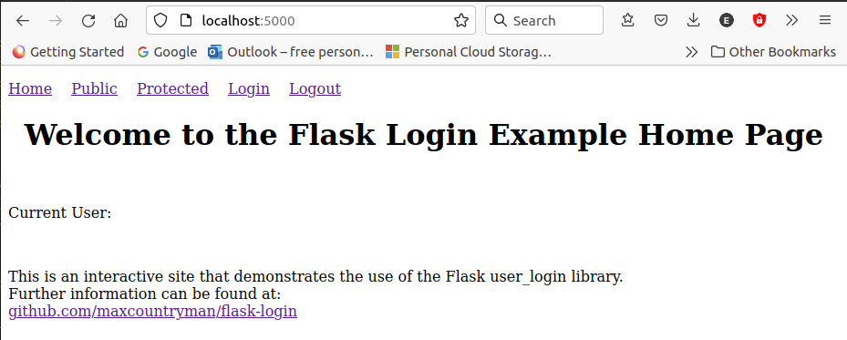

# Native Flask Authentication

Flask Login Sample Project

The purpose of this project is to show how to use the flask_login library to perform user
authentication in a simple Flask application.

I have spent many hours watching YouTube videos, reading tutorials, and trying code samples
that did not work. In addition to that, almost all of these want you to use an ORM. I am not going to get into the debate over the benefits of an ORM over simple database queries. Personally I am more comfortable with direct database interaction than I am with the overhead and learning curve required to use an ORM that forces me into a data structure that I have little to no control over. I realize this is a very contested topic, having stated my preferences, I will end my rant. At the end of the day it comes down to a personal choice. As such I have implemented this with a simple Python dictionary. Feel free to replace this with anything you choose.

The bulk of this work is based on documentation and source code for the flask_login library which can be found at:
https://github.com/maxcountryman/flask-login

The application is pretty “bare bones.” I have added comments in the app.py file that will hopefully explain all you need to know to get native Flask authentication running on your project. As this is not intended as an example of HTML5 of Jinja templates, the html files are very basic with no comments. The idea was just to provide a framework for testing the Flask application.

---

## Project Description

---

### Code Overview

The entirety of the Python code resides in the app.py file. The templates directory contains a set of very basic html files. I utilized a minimum of Jinja templating to keep the focus on implementation of the flask_login library. The html files are provided for demonstration purposes only. All the required dependencies for this project can be installed from the requirements.txt file:

```commandline
pip install -r requirements.txt
```

---

###The Basics
To start with I created a basic flask application:

```python
# These are the minimum components from flask needed for this demo.
from flask import Flask, request, render_template

# Create the application
app = Flask(__name__)


# Route to home page
@app.route('/')
def index():
    return render_template('index.html')


# launch the application
if __name__ == '__main__':
    app.run(debug=True)
```

It's always a good idea to test the application at this point to make sure that you have the basics working before moving forward. From a terminal navigate to the project folder. If you're using a virtual environment, make sure it's activated. Then start the application:

```commandline
(venv) eric@MontyPython:~/PycharmProjects/Authentication$ python app.py
```

If all goes well you will see:

```commandline
 * Serving Flask app 'app' (lazy loading)
 * Environment: production
   WARNING: This is a development server. Do not use it in a production deployment.
   Use a production WSGI server instead.
 * Debug mode: on
 * Running on http://127.0.0.1:5000/ (Press CTRL+C to quit)
 * Restarting with stat
 * Debugger is active!
 * Debugger PIN: 129-667-814
```

In a browser you can now navigate to: http://localhost:5000/
You should see:


---

### Adding Authentication

Now we can move on to adding authentication to the application. First we need to set Flask's secret key. If this is not set, Flask will not allow you to set or access the session dictionary. As flask_login uses session cookies to keep track of authenticated users, it will crash if this is not set.

```python
app.secret_key = 'use your own cryptic secret here'
```

We also need to create our "database" of users. As I mentioned earlier I am not going to enter into the debate over using an ORM here. What I am using is a simple dictionary to hold user information:

```python
users = {
    'foobar': {'firstname': 'foo', 'lastname': 'bar', 'password': 'foopassword'},
    'barfoo': {'firstname': 'bar', 'lastname': 'foo', 'password': 'barpassword'}
}
```

We have two users: foobar with a password of foopassword, and barfoo with a password of barpassword. In production this information, with encrypted passwords of course, would be saved in a database. The retrieval method is up to your personal preference.

We need to import the flask_login library:

```python
import flask_login
```

We now need to create and configure the login manager object:

```python
# Create and Configure the login manager.
login_manager = flask_login.LoginManager()
login_manager.init_app(app)
```

Telling Flask-Login how to load a user requires three things

<ol>
<li>A user object</li>
<li>a request_loader callback to load a user from a form request</li>
<li>A user_loader callback to load a user from a session</li>
</ol>


To create a user we will first need a User class. At a minimum this class needs to inherit from the UserMixin class. You can add more if you want, but this is all that is required.

```python
class User(flask_login.UserMixin):
    pass
```

We can now add the two required callbacks. The purpose of these callbacks is to create a user object for the successfully authenticated user and set the .id parameter to the username or any other unique identifier associated with the user.

```python
# user_loader callback
# This is for users that are already logged in
@login_manager.user_loader
def user_loader(username):
    if username not in users:
        return

    user = User()
    user.id = username
    return user


# request_loader callback
# This is for a new user login
@login_manager.request_loader
def request_loader(my_request):
    username = my_request.form.get('username')

    if username not in users:
        return

    user = User()
    user.id = username
    return user
```

Now we are ready to create a route that takes us to the login page, where users can enter and submit their credentials.

```python
# The login route gets the user name and password from the login form
@app.route('/login', methods=['GET', 'POST'])
def login():

    if request.method == 'GET':
        return render_template('login.html')

    # This section executes if the request method is POST
    # Get username from form
    username = request.form['username']
    password = request.form['password']

    # check that the user exists and that the password is correct
    if username in users and users[username]['password'] == password:
        user = User()
        user.id = username
        flask_login.login_user(user)
        # Display the successful login page
        return render_template('good_login.html')
    else:
        # Display the failed login page
        return render_template('bad_login.html')
```

Logging out a user is handled by defining a route:

```python
# This route will logout the user
@app.route('/logout')
def logout():
    flask_login.logout_user()
    return render_template('index.html')
```

To protect a route, simply add the ```@flask_login.login_required``` decorator before the route function definition. Only authenticated users will be allowed access to resources defined by these routes. Any routes without this decorator can be accessed by anyone.

That's all the basics. Now let's look at a couple of things to finish up this example.

---

### Display the User's Name

Let's create a function to determine what the name or the current authenticated user is, or return "Anonymous" if no user is logged in.

```python
def current_user():
    if flask_login.current_user.is_authenticated:
        return flask_login.current_user.id
    else:
        return 'Anonymous'
```

We can now pass this to our web pages to be displayed.
In the Python app:

```python
return render_template('index.html', username=current_user())
```

In html:

```html
<p>Current User: {{ username }}</p>
```

---

### Password Encryption

You should never store passwords in a database as clear text. To solve this problem we can easily hash the passwords and store the hashes. These hashes can be retrieved and compared to the user entered passwords. To do this we can use the werkzeug.security library.

```python
# These components are for generating and comparing password hashes.
from werkzeug.security import generate_password_hash, check_password_hash
```

To encrypt a password: ```generate_password_hash('foopassword')```
Now our if statement changes to:

```python
if username in users and check_password_hash(users[username]['password'], password):
```

---

### Final Thoughts

The code in this repository is a fully functional application. I have added a couple more routes to demonstrate more fully the functionality of the flask_login library. I have used third party authentication services, such as Okta, that provide a much richer and full-featured authentication service than outlined here. What I like about this is it is self-contained and simple. You have full control over how you implement user authentication.

If you have any questions or comments, please feel free to contact me at: [ejfeight@hotmail.com](mailto:ejfeight@hotmail.com).
I’m not an expert by any means, but I would appreciate your feedback, and I will be happy to provide any assistance I can.

I hope you find this helpful.

